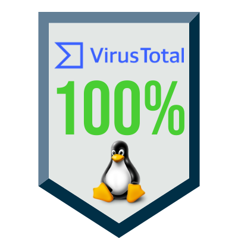
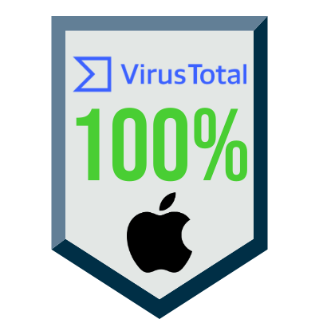

**ARCHIVED DUE TO LACK OF SELF-INTEREST IN THIS IDEA**
*IT WAS PART OF AN ASSIGNMENT FOR A COURSE PROJECT*

# The script

A **still-in-development script and GUI** to make the CATS fuzzing tool easier to use.
Currently it only supports the use of APIs with token autentication. Available for MacOS and Linux.

## Get the app

Executables are under the 
``
Executables
``
folder.

They do not requiere an installation, just download and execute.
## Deployment

To run this tool, it need CATS to be previously installed. To learn more about this tool you can visit [CATS website](https://endava.github.io/cats/).

## Free of malware

Malware scan with VirusTotal passed:

### Linux 

### MacOS 

## Future features
- Include all API autentication methods to the GUI.
- Include more flags possibilities
- Include all the output options that CATS offers.
